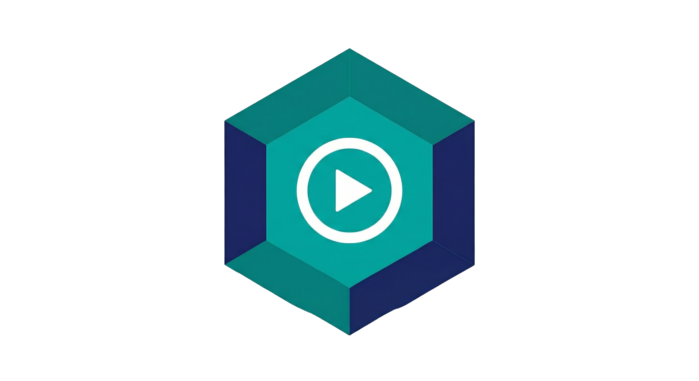

<p align="center">
  
</p>

<h1 align="center">Mediabox MCP</h1>

<p align="center">
  Self-hosted media server with AI-powered management via MCP, a native Desktop App, and a Telegram bot
</p>

<p align="center">
  
  
  
  
  
</p>

<p align="center">
  <a href="docs/README.en.md"></a>
  &nbsp;
  <a href="docs/README.es.md"></a>
</p>

---

### Three ways to run it

| Surface | Use case | Entry point |
|---------|----------|-------------|
| **Desktop App (Tauri)** | Recommended for Windows/macOS and local-first installs with a built-in setup wizard, dashboard, AI chat, log viewer, and one-click updates. The MCP server runs as a bundled sidecar — no external Node install needed. | `npm run dev:desktop` / packaged release |
| **CLI wizard** | Recommended for Linux servers, VPS, and headless deploys. Same orchestration engine the Desktop wizard uses, exposed as a one-shot interactive prompt. | `npx create-mediabox` |
| **Headless MCP server** | Plug the running stack into Claude Desktop, ChatGPT, Gemini, an OpenAI-compatible client, or the optional Telegram bot — over OAuth-protected `Streamable HTTP`. | `https://your-domain.com/mcp` |

All three share the same Docker stack, the same `@mediabox/core` orchestration pipeline, and the same set of MCP tools.

### Quick Start (CLI)

```bash
npx create-mediabox
```

One command. Answer a few questions. The CLI sets up the full stack automatically on a Linux server or VPS — Docker containers, API keys, service connections, media libraries, everything.

Supports **Local** (home network), **VPS** (with [Caddy](https://caddyserver.com/) and automatic HTTPS), and **Cloudflare Tunnel** (public access from home without opening ports) deployments.

> Requires Docker, Docker Compose, and Node.js >= 20. The unqualified `npx create-mediabox` command installs the current npm `latest` release. Use `--generate-only` to write config files without starting Docker. `--local-build` is for contributors running from a cloned repository root; normal `npx` installs use published GHCR images.

### Quick Start (Desktop App)

```bash
git clone https://github.com/JuanCMPDev/mediabox-mcp.git
cd mediabox-mcp
npm install
npm run dev:desktop
```

> Desktop builds need Rust (for Tauri) and [Bun](https://bun.sh/) (compiles the Node sidecar into a single executable via `bun build --compile`). On first launch the app walks you through a 9-step wizard — pick a language, run the Docker pre-flight check, set deployment mode, paths, credentials, optional AI provider, then deploy. The wizard streams live progress back into the UI.

### Architecture

```
                        Internet
                           │
              ┌────────────┼────────────┐
              │     Reverse Proxy       │
              │  (Caddy / nginx / etc)  │
              │   :80 / :443 (HTTPS)    │
              └────────────┬────────────┘
                           │ mediabox-net
┌──────────────────────────┼──────────────────────────────────────┐
│                          ▼                                      │
│  ┌──────────────────────────────────────────────────────────┐   │
│  │                Client Surfaces                           │   │
│  │  Mediabox Desktop · Telegram Bot · any MCP client        │   │
│  │  (Claude, ChatGPT, Gemini, custom)                       │   │
│  └──────────────────┬───────────────────────────────────────┘   │
│                     │ MCP (Streamable HTTP) · REST · NDJSON     │
│                     ▼                                           │
│  ┌──────────────────────────────────────────────────────────┐   │
│  │               MCP Server (:3000)                         │   │
│  │  /mcp · /api/dashboard · /api/chat · /api/setup          │   │
│  │  30 MCP tools · OAuth2 · @mediabox/chat-core · core      │   │
│  └──┬──────────┬──────────┬──────────┬──────────┬───────────┘   │
│     ▼          ▼          ▼          ▼          ▼               │
│  Jellyfin   Sonarr    Radarr    qBittorrent   PyLoad            │
│   :8096     :8989     :7878      :8085        :8000             │
│     │          │          │          │                          │
│     │       Prowlarr  ◄───┘          │                          │
│     │        :9696                   │                          │
│     │          │                     │                          │
│     │     FlareSolverr               │                          │
│     │        :8191                   │                          │
│     ▼                                ▼                          │
│  ┌──────────────────────────────────────────────────────────┐   │
│  │               Shared Media Volume                        │   │
│  │       /data/movies · /data/tv · /data/anime · /music     │   │
│  └──────────────────────────────────────────────────────────┘   │
└─────────────────────────────────────────────────────────────────┘
  Local mode:   ports exposed directly
  VPS mode:     ports bound to 127.0.0.1 + Caddy reverse proxy
  Tunnel mode:  ports bound to 127.0.0.1 + Cloudflare Tunnel
```

In the Desktop App the same MCP server runs as a Tauri sidecar (compiled to a native executable with `bun build --compile`), bound to `127.0.0.1` on a random port and authed via an ephemeral internal API key. The webview talks to it over HTTP exactly like a remote deploy.

### MCP Tools (30)

| Category | Tools | Description |
|----------|-------|-------------|
| **Jellyfin** | `server_status` `activity_log` `search_media` `show_details` | Library browsing, monitoring, playback history |
| **Library** | `manage_library` `manage_files` `rename_episodes` `get_library_state` `fix_subtitles` | File ops, subtitle conversion, batch renaming, cross-service state queries |
| **Sonarr** | `series_search` `series_status` `series_remove` `series_releases` `series_grab` `series_import` `series_rescan` | TV/anime management with auto ID resolution |
| **Radarr** | `movie_search` `movie_status` `movie_remove` `movie_releases` `movie_grab` `movie_import` `movie_rescan` | Movie management with duplicate prevention |
| **Downloads** | `download_add` `download_direct` `download_status` `cancel_downloads` | Direct URLs, PyLoad, queue management, orphan cleanup |
| **Maintenance** | `optimize_media` `cleanup_server` `check_jobs` | Strip tracks, clean server, monitor jobs |

The Desktop chat groups these into a smaller set of high-level *virtual tools* (e.g. `series`, `movies`, `downloads`) that the LLM picks first, then the engine routes the chosen action to the right MCP tool.

### What does the wizard do?

The Desktop wizard and the `create-mediabox` CLI share the same orchestration pipeline (`@mediabox/core`). Both replace ~15 manual setup steps with a single flow:

1. **Ask** for your preferences — deployment mode (Local/VPS/Tunnel), media paths, credentials, timezone, optional integrations. The Desktop wizard can configure the built-in AI chat; the CLI only asks for an AI provider when Telegram is enabled.
2. **Generate** `.env`, `docker-compose.yml`, `Caddyfile` (VPS), and pre-configures qBittorrent
3. **Start** all Docker containers and wait for each service to be ready
4. **Auto-configure** the entire stack via service APIs:
   - Extracts Sonarr/Radarr/Prowlarr API keys
   - Runs Jellyfin setup wizard, creates admin user and API key
   - Configures qBittorrent as download client in Sonarr/Radarr
   - Adds root folders and syncs Prowlarr indexers
   - Sets up FlareSolverr proxy and Jellyfin media libraries
   - Sets web UI credentials across all services

After setup, the only manual step is adding your torrent indexers in Prowlarr — the Desktop App walks you through it as a final wizard screen.

### Repository layout

```
mediabox-mcp/
├── docker-compose.yml          # Full service stack
├── .env.example                # Environment variable template
└── packages/
    ├── chat-core/              # LLM + MCP tool-calling engine (OpenRouter + Gemini)
    ├── contracts/              # Shared API types between server and UI
    ├── core/                   # Orchestration engine: generators, deployer, service clients
    ├── desktop/                # Tauri 2 desktop shell (bundles UI + MCP sidecar)
    ├── mcp-server/             # Express MCP + REST server (TypeScript)
    ├── mcp-telegram-client/    # Optional Telegram bot client
    ├── mediabox-cli/           # `npx create-mediabox` interactive wizard
    └── ui/                     # React UI for the Desktop App (Vite + TanStack Query + i18next)
```

See [docs/README.en.md](docs/README.en.md) (or [Español](docs/README.es.md)) for full installation, manual setup, and connection instructions.

---

## License

[MIT](LICENSE)
