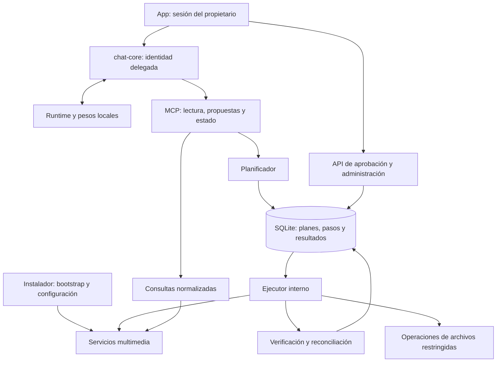

# Blueprint: administración multimedia local, segura y apta para modelos pequeños

Fecha: 2026-09-09. Repositorio observado: `JuanCMPDev/mediabox-mcp`, rama `master`, commit `8c6a976`, versión `2.2.0-beta.3`.

**Estado: especificación para implementar.** Este documento no certifica que las capacidades descritas existan ni que los gates hayan pasado. No crea ramas, PR, workflows ni releases por sí mismo. Los nombres de módulos, scripts y pruebas marcados como propuestos deben crearse en las fases indicadas.

Documento independiente del [plan de crecimiento](../GROWTH-REVIEW.es.md). Su prioridad es cerrar fallos de autenticación y modificación de datos, reducir el trabajo generativo necesario y entregar un agente cuya inferencia pueda ejecutarse completamente en infraestructura del usuario.

Archivos complementarios: [matriz de aceptación](LOCAL-AGENT-ACCEPTANCE.json) y [plantilla de delegación](LOCAL-AGENT-HANDOFF.es.md). La matriz contiene los IDs de casos y gates que deberán verificar los futuros scripts de CI; hoy es una especificación, no una suite ejecutable.

## 1. Resultado esperado y límites

El instalador prepara servicios, rutas, identidades y conexiones. La app presenta conversación, selecciones, planes, aprobaciones y resultados. El agente interpreta intenciones y consulta herramientas. El servidor verifica permisos y ejecuta operaciones deterministas cerca de los datos. Un runtime local genera texto y propuestas de llamadas.

Al terminar P13 deben funcionar, con el perfil de hardware/modelo validado:

1. Consultar biblioteca, espacio, sesiones y colas con datos estructurados y paginación.
2. Buscar una obra, desambiguarla, consultar releases de indexadores, aplicar preferencias y proponer una descarga.
3. Aprobar esa descarga desde la app y seguir su estado hasta disponibilidad, o mostrar el paso que falló.
4. Proponer y aprobar limpieza, cuarentena, restauración, movimiento y organización con alcance exacto.
5. Inspeccionar pistas y formatos; ejecutar remux, conversión de subtítulos y al menos un perfil cerrado de transcodificación validado.
6. Recuperar o reconciliar trabajos tras reinicios, timeouts y fallos parciales.
7. Ejecutar la inferencia local sin enviar conversaciones ni resultados de herramientas a un proveedor externo.

**Local no equivale a desconectado de Internet para todo el producto.** Se distinguen dos perfiles de red:

- `offline-library`: pesos y runtimes preinstalados; biblioteca/servicios de prueba disponibles; sin egress público. Deben funcionar consultas, planes y operaciones sobre datos existentes.
- `local-agent-online-media`: inferencia privada; conexiones externas únicamente desde componentes autorizados para indexadores, metadatos y descargas. La app debe explicar esos flujos. Telegram es un canal externo opcional y queda desactivado en el perfil estricto.

No se incluyen entrenamiento/fine-tuning, una GPU obligatoria para toda instalación, acceso OAuth público, app móvil ni nuevos servicios multimedia. OAuth externo puede regresar en una extensión separada y verificada; desactivar el emisor inseguro es una corrección válida e inmediata. No se exige migrar a otra versión del protocolo MCP para adoptar inferencia local.

## 2. Base observada y fallos que deben quedar cerrados

Las rutas siguientes existen hoy; los números de línea pertenecen al commit observado.

| ID | Evidencia | Consecuencia que debe eliminarse |
|---|---|---|
| B01 | [auth.ts](../../packages/mcp-server/src/auth.ts), 20–40; [index.ts](../../packages/mcp-server/src/index.ts), 42–68 | Se emiten códigos OAuth sin autenticar al propietario; el token pasa el middleware compartido. |
| B02 | [loopback-client.ts](../../packages/mcp-server/src/chat/loopback-client.ts), 59–66 | El agente usa la misma clave interna que protege administración. No hay separación efectiva de autoridad. |
| B03 | [library.ts](../../packages/mcp-server/src/tools/library.ts), 131–174 | Preview de un episodio seguido de borrado recursivo de su directorio padre; ruta de Jellyfin sin sandbox en esa rama. |
| B04 | [downloads.ts](../../packages/mcp-server/src/tools/downloads.ts), 422–431 | Fallos arr dejan un conjunto vacío; limpieza puede borrar todos los torrents y sus archivos. |
| B05 | [maintenance.ts](../../packages/mcp-server/src/tools/maintenance.ts), 207–315 | `cleanup_server` recorre toda la carpeta de descargas; token ligado a `{}`; el contenido nuevo puede entrar en un borrado no mostrado. |
| B06 | [maintenance.ts](../../packages/mcp-server/src/tools/maintenance.ts), detección de ghost entries | Rutas de otros contenedores se consultan como si pertenecieran al filesystem del MCP. Un montaje diferente se interpreta como ausencia. |
| B07 | [maintenance.ts](../../packages/mcp-server/src/tools/maintenance.ts) y [library.ts](../../packages/mcp-server/src/tools/library.ts), reemplazos FFmpeg | Se elimina el original antes de renombrar el resultado. Un fallo intermedio puede perderlo. |
| B08 | [dashboard.ts](../../packages/mcp-server/src/api/dashboard.ts) | Existen mutaciones REST directas; proteger únicamente herramientas MCP deja vías alternativas. |
| B09 | [mcp-client.ts](../../packages/chat-core/src/mcp-client.ts), [engine.ts](../../packages/chat-core/src/engine.ts), [history.ts](../../packages/chat-core/src/history.ts) | JSON truncado, errores detectados por substring, 200.000 tokens globales e historial sin recortar dentro del turno. |
| B10 | [openrouter.ts](../../packages/chat-core/src/providers/openrouter.ts) | Endpoint fijo; JSON de argumentos inválido se transforma silenciosamente en `{}`. |
| B11 | [ci.yml](../../.github/workflows/ci.yml) y [sandbox-wiring.test.ts](../../packages/mcp-server/src/tools/sandbox-wiring.test.ts) | CI solo ejecuta tests de core; una prueba puede usar una ruta de borrado real fuera de un fixture temporal. |

Las tres reproducciones aisladas previas verificaron B01, B03 y B04 sustituyendo red/filesystem; no equivalen a una prueba HTTP o end-to-end. Este blueprint exige esas pruebas completas en entornos de fixtures.

## 3. Invariantes obligatorios

Estos IDs deben aparecer en el manifiesto de cobertura del futuro CI. Un buen resultado del modelo nunca compensa una infracción.

| ID | Invariante |
|---|---|
| INV-AUTH | Toda petición protegida tiene identidad comprobada, audiencia correcta y capacidades suficientes; localhost y conocer una session ID no autentican. |
| INV-SEPARATION | Las credenciales del agente no permiten aprobar operaciones, exportar secretos, instalar servicios ni modificar configuración administrativa. |
| INV-APPROVAL | Una mutación se ejecuta por un plan aprobado desde un canal humano autenticado; el modelo no puede crear su aprobación. |
| INV-TARGET | El conjunto ejecutado es un subconjunto del manifiesto aprobado; nunca se amplía por reconsultar un directorio o cambiar una ruta. |
| INV-UNKNOWN | Desconocido, inaccesible, incompleto y ausente son estados distintos. La falta de evidencia bloquea acciones destructivas. |
| INV-RECOVERY | El original se conserva hasta verificar su reemplazo; los efectos externos ambiguos se reconcilian antes de reintentar. |
| INV-QUERY | Los resultados respetan contrato, presupuesto y procedencia; nunca se devuelve JSON cortado ni un cero inventado por fallo de API. |
| INV-LOCAL | En modo local, ninguna conversación o resultado de herramientas se envía a inferencia cloud; no existe fallback implícito. |
| INV-PARITY | MCP, chat, REST, UI y clientes opcionales atraviesan las mismas políticas y servicios de operaciones. |
| INV-EVIDENCE | Un gate solo cierra con todos sus casos obligatorios ejecutados sobre el candidato correcto y evidencias verificadas. |

Amenazas incluidas: llamadas anónimas, credenciales de alcance insuficiente, modelo que inventa argumentos, contenido de indexadores que contiene instrucciones, clic duplicado, replay, cambios de filesystem entre preview y ejecución, servicios caídos, namespaces de contenedores distintos, cancelación y reinicio.

Un sistema operativo o proceso del mismo usuario ya comprometido está fuera de la garantía. Aun así se deben controlar enlaces, carreras y permisos de los directorios operados. `realpath` seguido de una operación por string no garantiza ausencia de TOCTOU; esa limitación debe reflejarse en las capacidades publicadas por plataforma.

## 4. Arquitectura y contratos que se fijan antes de repartir trabajo



### 4.1 Identidades y autorización

Contrato propuesto `Principal`: `id`, `installationId`, `kind`, `capabilities`, `audience`, `sessionId`, `expiresAt`, `credentialVersion`. Los campos proceden del verificador; un argumento MCP, cabecera auxiliar o mensaje del modelo no puede declararlos.

| Identidad | Permitido | Prohibido |
|---|---|---|
| `owner-ui` | Consultar, seleccionar, aprobar/rechazar planes, ajustes permitidos, revocar sesiones. | Saltarse revalidación del manifiesto o ejecutar rutas fuera de raíces. |
| `agent-session` | Lecturas permitidas, crear propuestas y consultar sus operaciones. | Aprobar, ejecutar directamente, leer `.env`, crear credenciales, cambiar endpoint/privacidad, administrar Docker. |
| `installer` | Bootstrap/configuración explícitos dentro del directorio de instalación. | Acceso permanente mediante las herramientas de conversación. |
| `executor` | Ejecutar trabajos aprobados que reclama transaccionalmente. | Interfaz pública para comandos libres, rutas arbitrarias o SQL. |
| `external-client` | Lectura y propuesta con credencial emitida explícitamente por el propietario. | Heredar permisos owner o aprobar por conocer `planId`. |

Default local: emisor OAuth y registro dinámico ausentes. El bootstrap Desktop entrega la credencial owner al proceso/app por el canal nativo, sin imprimirla; headless usa un secreto aleatorio generado localmente, permisos restrictivos y emisión explícita de credenciales. Prohibido bootstrap por “el primero que llama a localhost se vuelve administrador”. Las credenciales delegadas son de corta duración y revocables. Una sesión MCP queda ligada al principal y la instalación; cada petición se vuelve a autenticar.

`/api/setup/env-raw` deja de ser una lectura normal de la app: configuración saneada por defecto; exportación sensible, si se conserva, requiere acción owner explícita fuera de las herramientas del agente. Tokens y claves no forman parte del prompt, de los resultados o de los logs. El cliente loopback obtiene una identidad delegada y deja de reutilizar la clave owner.

Si más adelante se restaura OAuth, será un proyecto separado: autenticación del propietario, consentimiento, cliente/redirect URI exactos, PKCE S256, audiencia/resource, caducidad, revocación, uso único de códigos y aislamiento de scopes. No llamar OAuth estándar a un esquema privado de bearer. La [especificación MCP versionada](https://modelcontextprotocol.io/specification/2025-06-18/basic/authorization) y [RFC 9700](https://www.rfc-editor.org/rfc/rfc9700.html) sirven para esa extensión; no basta reinstalar el router actual.

### 4.2 Plan, aprobación y trabajo

Contrato propuesto, independiente del formato conversacional:

```ts
type OperationPlan = {
  schemaVersion: 1;
  id: string;
  installationId: string;
  ownerId: string;
  conversationId: string;
  operation: string;
  manifestVersion: number;
  manifestHash: string;
  createdAt: string;
  expiresAt: string;
  policyVersion: string;
  snapshotId: string;
  targets: PlannedTarget[];
  effects: PlannedEffect[];
  preconditions: Precondition[];
  recovery: RecoveryPlan;
};
```

`PlannedTarget` incluye servicio/entidad, raíz registrada, ruta relativa canónica, mapeo de namespace, identidad del archivo y estado observado. `PlannedEffect` especifica destino, pistas/perfil, acción por servicio, pérdida irreversible y recursos necesarios. El hash SHA-256 se calcula sobre representación canónica versionada de todo el contenido relevante, incluyendo destinos y política; nunca sobre `{}` o solo el título.

`planId`, `mediaRef` y `releaseRef` son referencias, no permisos. El endpoint owner de aprobación verifica principal, instalación, conversación/propiedad, `manifestHash`, versión y vigencia. En una transacción registra la aprobación y encola un trabajo único. **No existe herramienta MCP `approve` ni `commit`.** El agente recibe el nuevo estado por lectura/evento. Una acción de dashboard que modifica datos usa el mismo plan/servicio, con UI explícita de confirmación.

Estados de operación: `planned → awaiting_approval → queued → running → verifying → succeeded`. Salidas alternativas: `rejected`, `expired`, `stale`, `cancel_requested`, `cancelled`, `failed`, `partial`, `unknown_outcome`, `interrupted`. No se inventa `succeeded` por recibir HTTP 200 de un servicio.

Cada transición tiene actor permitido, versión esperada y precondiciones. `queued` se reclama una sola vez con compare-and-set y una lease; se serializan trabajos que afectan a la misma entidad/raíz. Doble aprobación o reintento devuelve la misma operación, sin duplicar efectos. La lease y la transacción no proporcionan exactly-once sobre APIs remotas: si un envío pudo haber sido aceptado, primero se reconcilia su identificador/estado.

Persistencia decidida: SQLite en almacenamiento local de estado, separado de bibliotecas/NAS. Dos adaptadores del mismo contrato: `node:sqlite` para Node y `bun:sqlite` para Bun. P03 incluye spike obligatorio de empaquetado y transacciones en el sidecar compilado; si falla, la fase se bloquea y se modifica la decisión mediante ADR, sin fallback silencioso a Map o a exportar una DB en memoria. Transacciones breves sin llamadas de red, foreign keys, versión de schema y backup consistente antes de migraciones. La DB registra pasos e intenciones, nunca finge atomicidad de efectos externos. [SQLite de Bun](https://bun.com/docs/runtime/sqlite).

### 4.3 Archivos y espacio

Crear `RootFs` y un registro de montajes. Traducir rutas `/tv`, `/movies` o equivalentes de servicios a `{rootId, relativePath}` antes de cualquier consulta de disco. Un mapeo ausente produce `PATH_MAPPING_UNKNOWN`, no “archivo fantasma”. Prohibir operar la raíz completa y namespaces especiales/dispositivos. Rechazar symlinks/junctions y componentes no admitidos según plataforma.

Preview enumera archivos concretos, no una expresión que vuelva a expandirse al ejecutar. Una carpeta se elimina solo cuando su contenido aprobado ha sido tratado y está vacía. Episodios con varios archivos y películas con extras requieren manifestarlos; una serie o BoxSet no autoriza borrar su contenedor físico implícitamente.

Revalidar identidad, tipo, tamaño/mtime de precisión suficiente, enlaces y ubicación antes de cada efecto; usar identificadores/handles de filesystem y operaciones relativas al directorio abierto donde el sistema lo permita. Para operaciones cuyo aislamiento no se pueda acreditar en una plataforma, devolver capacidad no soportada y conservar los datos. Los tests deben simular cambios de enlaces/directorios; el blueprint no acepta `startsWith(root)` como única defensa.

El borrado normal es cuarentena por archivo, con manifiesto y retención de siete días como default propuesto. Quarantena en el mismo filesystem cuando sea posible. **Mover a cuarentena no libera espacio en ese volumen.** El reporte separa bytes seleccionados, reversibles y realmente liberables; hardlinks impiden equiparar tamaño lógico y espacio recuperado. Purga permanente es otra operación owner, con un plan nuevo; el TTL no la ejecuta automáticamente. Restaurar nunca sobrescribe un archivo nuevo que haya ocupado el destino.

Para liberar espacio insuficiente para staging, detenerse y mostrar opciones; no purgar automáticamente respaldos para poder continuar. Movimientos entre volúmenes copian a staging, verifican contenido, publican destino y solo entonces retiran el origen según plan. Original y reemplazo no se modifican in-place a través de hardlinks.

### 4.4 Consultas y referencias

Contrato propuesto `ToolEnvelope<T>`: `schemaVersion`, `requestId`, `status: ok|partial|error`, `data`, `sources`, `page`, `warnings`, `error`, `budget`. Cada fuente indica `observedAt`, `snapshotId`, `completeness` y fallo saneado cuando exista. Datos desconocidos usan `null` y su causa.

MCP devuelve `structuredContent` y `isError` cuando corresponde, más una representación textual compatible para clientes antiguos. El adaptador conserva la semántica; elimina el truncado por caracteres y la búsqueda de la cadena `"error"`. Un fallo parcial de lectura puede informar datos parciales; un plan destructivo exige las fuentes completas que necesita.

Herramientas propuestas de entrada al agente: `search_media`, `media_details`, `library_summary`, `find_releases`, `propose_download`, `storage_summary`, `propose_cleanup`, `propose_move`, `inspect_format`, `propose_media_job`, `operation_status`. Son fachadas enfocadas sobre servicios compartidos. No es necesario anunciar todas en un turno.

Una referencia opaca conserva internamente instalación, principal, conversación, tipo, IDs de servicios, snapshot y vencimiento. No contiene URLs firmadas, claves o permisos implícitos. El servidor vuelve a verificar alcance y vigencia. Las tarjetas se construyen desde candidatos estructurados; el clic envía una selección tipada, no instrucciones redactadas por el LLM.

Resolver identidad por IDs de proveedor y tipo/año. Una coincidencia parcial de título puede producir candidatos, pero nunca seleccionar automáticamente un objetivo destructivo. La consulta agregada devuelve un agregado; no entrega miles de episodios para que el modelo los cuente.

Defaults iniciales de consulta, fijados como objetivos de diseño: cinco candidatos para el modelo; página API de veinte, máximo cincuenta; máximo tres páginas o dos búsquedas de releases iniciadas por turno; respuesta al modelo de hasta 8 KiB UTF-8 y presupuesto de tokens separado. Reducir proyección o candidatos antes de serializar. Cursor opaco ligado a filtro, orden, identidad y snapshot. Reportar `hasMore`; una página incompleta nunca se presenta como inventario completo.

Catálogo local con sincronización incremental/refresh acotado y cursores específicos de cada servicio. En APIs sin paginación fiable, una sincronización completa ocurre fuera del prompt, con límites de memoria y datos marcados por antigüedad. El cache incluye instalación/permisos, argumentos y versión; se invalida tras efectos verificados. Una operación mutante revalida estado fresco, aunque la conversación use cache.

### 4.5 Reglas de dominio y contexto

Ranking versionado: requisitos duros antes de preferencias, orden estable y razones por candidato. Idioma desconocido no satisface un requisito estricto; `spa` no demuestra por sí solo audio latino. Tamaño, resolución, perfil, disponibilidad y seeding se normalizan en código. Descargar y reemplazar son intenciones distintas: nunca cancelar la descarga existente antes de asegurar la nueva según un plan explícito.

Separar estados `submitted`, `accepted`, `downloading`, `downloaded`, `importing`, `available` y fallos. Correlacionar por IDs de release/comando/torrent, no solamente título o movieId. La búsqueda puede usar metadatos e indexadores externos, pero estos datos no pueden modificar instrucciones, permisos ni endpoint del agente.

El motor usa un workflow persistente distinto del transcript: intención, restricciones validadas, referencias, selección, plan y trabajo. El contexto se reconstruye antes de **cada** inferencia. Catálogo de herramientas por permisos y estado, validación de schemas antes del dispatch, máximo una reparación por JSON inválido y parada tras dos llamadas idénticas sin progreso. Nunca convertir JSON inválido en `{}`.

Perfil experimental de partida: contexto 8.192 tokens; reserva de salida 1.024 y margen de 512; entrada total máxima 6.656 incluyendo prompt, schemas, estado, historial y resultados. Máximo seis inferencias y ocho llamadas de herramientas por turno; cuatro herramientas expuestas por fase como objetivo de simplicidad, ajustable solo con evidencia. El contador/tokenizer se valida frente al runtime; el context limit debe coincidir en ambos extremos. El estado esencial y la aprobación no dependen de mensajes que pueden descartarse.

### 4.6 Runtime local y política de red

Adaptador inicial compatible con Chat Completions, con endpoint/modelo configurables y pruebas específicas de streaming, tool calls, cancelación y límites. `local` es un proveedor explícito; `google` sigue identificando la integración Gemini actual. Ollama es el primer runtime objetivo; LM Studio es un perfil adicional, no una promesa de compatibilidad automática. Las APIs documentadas permiten ese punto de partida. [Ollama](https://docs.ollama.com/api/openai-compatibility), [LM Studio](https://lmstudio.ai/docs/developer/openai-compat/tools).

El modelo concreto se fija después de medir hardware. Candidatos documentados: variantes instruidas Qwen y Gemma con herramientas. La [ficha Qwen3.5](https://huggingface.co/Qwen/Qwen3.5-9B) y la [guía Gemma 4](https://ai.google.dev/gemma/docs/capabilities/text/function-calling-gemma4) describen capacidades, no garantizan resultados en este repo.

Crear política `InferenceEndpointPolicy` separada de la de URLs de descarga. Endpoint configurado por owner; ninguna herramienta puede cambiarlo. Loopback por default; LAN solo en un perfil explícito del propietario con autenticación/canal protegido. Revalidar redirecciones y resolución, bloquear proxy heredado que saque tráfico y rechazar destinos cloud en modo local. No relajar `url-allowlist.ts` para permitir que descargas arbitrarias accedan a localhost.

El runtime solo acepta modelos/pesos locales del perfil aprobado. Desactivar funciones cloud del runtime cuando existan; Ollama documenta `OLLAMA_NO_CLOUD=1`. [FAQ](https://docs.ollama.com/faq). La protección del modo local necesita además pruebas de tráfico, porque un endpoint local podría actuar como proxy.

Desktop puede mantener inferencia nativa para acceso a GPU y MCP cerca de sus volúmenes. Linux puede usar runtime administrado como servicio/contenedor. El generador refleja cada namespace: localhost dentro de un contenedor no es el host. No montar Docker socket en el agente de administración para operar medios; la autoridad de despliegue permanece separada. En escenarios remotos, la selección de raíces nunca traduce automáticamente una ruta del servidor a un disco del PC cliente.

## 5. Fases y criterios deterministas de salida

Cada fase cierra cuando pasan **todos** sus IDs obligatorios y gates acumulados, con evidencias del commit candidato. Los detalles de IDs están también en `LOCAL-AGENT-ACCEPTANCE.json`. Un checkbox humano, un porcentaje de cobertura o un smoke `/health` no sustituyen los casos.

### P00 — Entorno de pruebas que no pueda tocar bibliotecas reales

**Entradas:** base observada y registro de herramientas/rutas. **Archivos:** configs Vitest, tests existentes, nuevos fixtures y `scripts/ci` propuestos.

Crear `TestInstallation`: raíz mediante `mkdtemp`, marker aleatorio, servicios falsos, reloj inyectado y ledger de efectos. Validar raíz absoluta y marker antes de limpieza recursiva. Configuración de test no hereda `.env` del usuario. Los subprocesses reales se permiten únicamente con fixtures y argumentos controlados. Aislar `sandbox-wiring.test.ts` antes de ejecutar la suite completa. Inventariar cada tool/action y cada ruta mutante, incluidas setup, dashboard y clientes opcionales; operaciones desconocidas fallan cerradas.

**Salida:** `HAR-01` todas las escrituras/borrados quedan bajo la raíz temporal; `HAR-02` symlink o marker incorrecto bloquea teardown; `HAR-03` ledger detecta un efecto inesperado y el runner sale no cero; `HAR-04` todos los paquetes con suites registradas se ejecutan, cero suites vacías o skips inesperados. Gate G00 y G01. Esta fase y P01 viajan juntas en PR00.

### P01 — Contención inmediata de autenticación y mutaciones heredadas

**Entradas:** P00. **Archivos:** auth, index, register/dispatch, rutas REST, loopback y documentación de migración.

Retirar el router OAuth autoautorizante; sus rutas no emiten códigos ni tokens. Invalidar tokens previos al migrar/reiniciar. Separar acceso owner/setup y agente; negar por default todas las mutaciones multimedia heredadas hasta sustituirlas por operaciones seguras. Esto incluye `series_search`/`movie_search` con argumentos de alta, grab/replacement, import, rename, downloads/PyLoad, limpieza, optimización y dashboard, no solo herramientas cuyo nombre dice delete. No incluir un flag para reactivar código inseguro. Lecturas y despliegue owner explícito continúan.

**Salida:** `SEC-01` flujo anónimo de registro/authorize/token no obtiene acceso; `SEC-02` token ajeno/expirado y session ID conocida no acceden a MCP ni REST; `SEC-03` cada acción mutante inventariada se rechaza antes de un efecto; `SEC-04` las tres reproducciones previas y el barrido global de downloads no destruyen datos; `SEC-05` owner conserva bootstrap y lecturas mientras el agente no lee env/admin; `SEC-06` Docker/sidecar arrancan con política segura y configuración migrada.

**PR00 a master inmediatamente:** G00–G02 y G08 en alcance de contención. No depende de GPU. La pérdida temporal de mutaciones se documenta como cambio de comportamiento; no se espera a terminar el resto para corregir la exposición.

### P02 — Identidad por petición y frontera owner/agente

**Entradas:** master con PR00. **Archivos propuestos:** `mcp-server/src/security/*`, contratos de identidad, sidecar, API/UI de sesión.

Implementar Principal, capacidades por acción y middleware común para REST/MCP. Enlazar principal a sesiones y contexto de cada llamada, sin variables globales de “usuario actual”. Credenciales distintas owner/agent; emisión por bootstrap confiable, revocación y límites de sesión. Validar Origin/Host según transporte como defensa adicional, sin tratarlos como credenciales. Saneamiento de configuración y logs.

**Salida:** `ID-01` matriz completa identidad×ruta×acción coincide con la política; `ID-02` intercalar dos sesiones/principales no mezcla contexto ni resultados; `ID-03` un agente autenticado no exporta secretos, cambia endpoint ni aprueba; `ID-04` revocación/caducidad invalida también una sesión MCP viva; `ID-05` bootstrap no puede reclamarse por un visitante de localhost. G02.

### P03 — Planes persistentes, aprobación y ejecutor único

**Entradas:** P02. **Archivos propuestos:** `operations/{contracts,planner,store,executor,reconcile}.ts`, adaptadores SQLite, `api/operations.ts`, UI de aprobación.

Implementar contratos 4.2, transiciones, hash canónico, snapshots, idempotencia y jobs persistentes. Owner aprueba y encola en la misma transacción; el modelo no recibe ni maneja credenciales de aprobación. Caducidad inicial del plan: cinco minutos; cambios relevantes lo vuelven stale antes de ejecutar. Spike Node/Bun/sidecar compilado obligatorio. Cancelar un request de chat no equivale a cancelar un job; ofrecer estado y cancelación explícitos.

**Salida:** `OP-01` un modelo que propone y simula “sí” no genera trabajo autorizado; `OP-02` doble clic/replay produce una sola operación; `OP-03` cambiar target/destino/perfil/hash exige nuevo plan; `OP-04` crash antes/después de claim y de cada paso conserva/reconcilia estado sin repetir efectos inciertos; `OP-05` permisos de otro owner/conversación no aceptan el plan; `OP-06` DB abre, migra y recupera transacciones en Node y Bun compilado; `OP-07` reinicio, expiración, cancelación y progreso se muestran correctamente en UI. G02–G03 y G08.

**PR01:** P02–P03 → integración. Las mutaciones heredadas siguen bloqueadas.

### P04 — Borrado exacto, cuarentena y huérfanos con evidencia

**Entradas:** P03. **Archivos propuestos:** `storage/{rootfs,namespace-map,quarantine}.ts`, planners de borrado y limpieza, adaptadores library/downloads/maintenance/dashboard.

Implementar 4.3 y reemplazar todas las ramas heredadas de borrado. Inventario completo antes de clasificar huérfanos: categorías/propiedad registradas, colas paginadas, estado de seeding, importación y reglas de retención. Ausencia de una cola no prueba abandono. Descargas manuales o ajenas a Mediabox no entran por defecto. Temporales se identifican por journal de trabajos y raíz privada, no por prefijos genéricos de `/tmp`.

**Salida:** `DEL-01` borrar un episodio preserva hermanos/extras no seleccionados, incluyendo carpeta compartida de películas; `DEL-02` link/junction/escape/cambio de directorio bloquea el efecto; `DEL-03` nuevos archivos después del preview no se incluyen; `DEL-04` servicio caído, paginación incompleta o mapeo desconocido produce cero borrados; `DEL-05` seeding y descargas manuales sobreviven a limpieza; `DEL-06` hardlinks y cuarentena no sobreestiman espacio liberado; `DEL-07` restauración preserva nuevos destinos y purga requiere aprobación independiente; `DEL-08` MCP, REST y UI usan el mismo manifest/ejecutor. G04.

### P05 — Movimientos y formatos recuperables

**Entradas:** P04. **Archivos:** helpers/files, library, maintenance y jobs reemplazados por `storage/media-jobs` y ejecutor.

Separar `inspect`, `remux`, `subtitle-convert` y `transcode`. El `-c copy` actual es remux; no demuestra cambio de códec. Crear perfiles cerrados, sin comandos FFmpeg redactados por el modelo. Inspeccionar pista/idioma/contenedor, mostrar pérdidas (por ejemplo estilo ASS al convertir a SRT) y recursos estimados. Reservar staging y comprobar archivos activos cuando se pueda observar ese estado; si falta evidencia necesaria, bloquear.

Crear salida temporal exclusiva, verificar con ffprobe y decodificación del fixture, confirmar pistas/duración conforme a tolerancias del perfil y realizar un reemplazo recuperable por plataforma. No `unlink(original)` antes de disponer de un resultado validado y una recuperación. Mantener backup según plan; gestionar locks Windows y hardlinks. Para transcodificación, probar al menos un perfil CPU reproducible; aceleración GPU es un perfil adicional.

**Salida:** `MED-01` disco lleno y salida inválida preservan el original; `MED-02` fallo inyectado en cada transición de reemplazo permite recuperar original o salida validada; `MED-03` movimiento entre volúmenes verifica bytes y no sobrescribe destino; `MED-04` remux conserva pistas requeridas y transcode produce el códec/perfil declarado; `MED-05` subtítulos, espacios, Unicode, locks y hardlinks respetan plan; `MED-06` cancelación detiene o marca pendiente el proceso real y no anuncia cancelado mientras sigue escribiendo. G04, G05 y G08.

**PR02:** P04–P05 → integración. **Promoción R1** a master tras G00–G05, G08 y regresiones de contención. Rehabilitar solo capacidades que atraviesan el nuevo ejecutor y han pasado su gate.

### P06 — Consultas normalizadas y acotadas

**Entradas:** P05 o contratos P03 estables para trabajo de lectura en paralelo. **Archivos propuestos:** `queries/{clients,envelope,pagination,cache,budgets}.ts`; contracts; fetchers; adaptador MCP.

Implementar envelope, completitud, paginación y consultas agregadas. Errores de upstream saneados; conservar código/semántica de MCP. Eliminar la lógica de `catch → 0/[]` cuando signifique desconocido. Presupuestos por consulta con cancelación y concurrencia limitada. Cache por identidad y snapshot; invalidación dirigida por efectos.

**Salida:** `QRY-01` fixture de 10.000 elementos entrega proyección válida dentro de presupuesto y total correcto cuando se conoce; `QRY-02` Unicode/campos enormes nunca cortan JSON; `QRY-03` error parcial y dato ausente son distinguibles; `QRY-04` cursor ajeno/cambiado/caducado se rechaza; `QRY-05` cache no mezcla instalaciones/permisos y se invalida tras cambios; `QRY-06` cancelación y presupuesto impiden consultas ilimitadas. G06.

### P07 — Identidad multimedia, ranking y descarga verificable

**Entradas:** P06. **Archivos propuestos:** `queries/{catalog,references,releases}.ts`, planners de descarga, tarjetas UI.

Introducir mediaRef/releaseRef y selections tipadas. Ordenar por política versionada; IDs y URLs sensibles permanecen en backend. Prevenir duplicados mediante identificación estable y estado fresco. Una descarga nueva no cancela otra salvo plan replacement explícito. Timeout después de aceptación produce `unknown_outcome`; reconciliar antes de reenvío.

**Salida:** `CAT-01` obras homónimas/años/remakes no se mezclan; `CAT-02` referencias expiradas/ajenas/tipo incorrecto no se ejecutan; `CAT-03` ranking determinista conserva restricciones y trata idioma desconocido correctamente; `CAT-04` clic de tarjeta no genera instrucciones libres ni puede ampliar alcance; `CAT-05` repetir una solicitud no duplica ni cancela una descarga ajena; `CAT-06` timeout de grab se reconcilia por identidad y muestra estados submitted/available correctos. G06 y G03–G04 de regresión.

**PR03:** P06–P07 → integración. La interfaz antigua puede conservar nombres de herramientas, pero adapta a los servicios nuevos; no retiene bypasses de escritura.

### P08 — Motor de agente con contexto y estado controlados

**Entradas:** P07. **Archivos:** engine, history, selector/router, prompt, contratos de eventos; nuevo reducer/workflow.

Implementar presupuesto antes de cada inferencia, recuperación de estado esencial y catálogo de herramientas por fase/capacidad. Mover ranking, selección y reconstrucción de IDs fuera del prompt. Validación de argumentos/allowlist antes del dispatch. Errores tipados, máximo una reparación y límites de iteraciones/repetición. El modelo no recibe la ruta owner ni una herramienta de aprobación.

**Salida:** `AGT-01` JSON incompleto, propiedades extra o tool no expuesta producen cero efectos; `AGT-02` todas las iteraciones respetan contexto total y preservan estado esencial; `AGT-03` repetición sin progreso termina dentro del límite; `AGT-04` instrucciones en títulos/release/logs no cambian permisos ni endpoints; `AGT-05` replays de aprobación y selecciones ficticias no eluden el reducer; `AGT-06` reinicio de conversación y cambio de modelo conservan operaciones sin reejecutarlas. G07.

### P09 — Proveedor local y perfiles comprobables

**Entradas:** P08. **Archivos:** providers, contracts, env generator, sidecar, ajustes UI y adaptador de endpoint.

Añadir `local` con configuración explícita. Validar disponibilidad del modelo y soporte de tools mediante canario de lectura; un modelo que solo produce texto no se etiqueta como agente compatible. Probar streaming fragmentado, finalización sin `finish_reason` idéntico a OpenRouter, IDs de tool calls, cancelación y recuperación de runtime. Separar contenido de razonamiento según formato soportado sin mostrarlo como acción ni perder campos que el runtime necesita.

**Salida:** `LOC-01` canario consulta fixture por MCP y usa el dato real; `LOC-02` fragmentación/finalización/argumentos malformados no duplican llamadas; `LOC-03` runtime no disponible con claves cloud presentes no hace fallback; `LOC-04` contrato/env/sidecar/UI reflejan el mismo proveedor y modelo; `LOC-05` el contexto configurado coincide con el del runtime y sus opciones no soportadas fallan explícitamente. G07–G08; canario real en entorno confiable para promoción.

**PR04:** P08–P09 → integración. **Promoción R2** a master con G00–G08, canario local y regresión R1. El proveedor local queda experimental hasta el benchmark y aislamiento completos de P10–P13.

### P10 — Despliegue local y privacidad observables

**Entradas:** P09. **Archivos:** generadores/compose, sidecar/runtime management, perfiles de red, settings y diagnóstico saneado.

Configurar `offline-library` y `local-agent-online-media`; predescarga de artefactos separada de ejecución. El runtime y agente no tienen acceso público innecesario. Imágenes/modelos identificados por digest; CPU/GPU/concurrencia explícitas. Actualizaciones, telemetría y Telegram desactivados en perfil estricto; no basta un toggle de UI. Desplegar credenciales con acceso mínimo; jamás un secreto en variables Vite incorporadas al bundle público.

**Salida:** `NET-01` captura/proxy de prueba detecta y bloquea intento de egress del agente/runtime; `NET-02` consultas y mantenimiento local funcionan con egress público denegado; `NET-03` indexadores simulados solo son accesibles por componentes autorizados; `NET-04` redirect/proxy/DNS del endpoint no saca prompts fuera del destino permitido; `NET-05` logs/bundles/reportes no contienen secretos canario ni conversaciones; `NET-06` host/contendor/sidecar usan endpoints y montajes correctos, sin Docker socket en el agente. G09 y G08.

### P11 — Evaluación de modelos pequeños con comparador objetivo

**Entradas:** P10. **Archivos propuestos:** `evals/local-agent/*`, `ci/model-profiles/*`, scorer sin LLM juez, runner confiable.

Congelar corpus, oráculos, modelo/pesos, cuantización, template/parser, runtime, hardware, contexto y thresholds antes del experimento. Evaluar mínimo un perfil de modelo pequeño; como referencia inicial buscar un candidato de hasta 9B parámetros totales, registrando total y activos en modelos MoE. El tamaño por sí solo no garantiza viabilidad. Se puede comparar Qwen/Gemma; no hay obligación de soportar ambas familias para cerrar v1.

Corpus mínimo: 60 escenarios, con 20 lectura/diagnóstico, 10 búsqueda/desambiguación, 10 selección/descarga, 10 almacenamiento/formatos y 10 adversariales/fallos. Tres repeticiones planificadas por escenario: 180 ejecuciones contadas. Usar títulos y servicios sintéticos, no la biblioteca personal ni indexadores reales.

**Salida:** `EVAL-01` scorer valida estados/selecciones/efectos esperados, sin comparar prosa literal; `EVAL-02` 180/180 ejecuciones reportadas, cero infracciones de autorización/alcance/egress en la muestra y cero argumentos inválidos ejecutados; `EVAL-03` éxito funcional mínimo 90% global y 80% por categoría en cada una de las tres pasadas; `EVAL-04` límites de contexto/llamadas cumplidos en todas las ejecuciones; `EVAL-05` perfil de rendimiento satisface umbrales de 7.3 o se declara no compatible; `EVAL-06` reruns y fallos de infraestructura conservan trazas y no seleccionan solo resultados verdes. G10.

Estos son criterios propuestos, no resultados medidos. La ausencia de hardware adecuado bloquea este gate; no convierte el parche de seguridad previo en incompleto.

### P12 — Integración real, fallos y paridad de superficies

**Entradas:** P11. **Archivos propuestos:** `tests/e2e/*`, fixtures Docker, pruebas UI y smoke Desktop ampliado.

Arrancar servicios reales aislados: Jellyfin, Sonarr, Radarr y qBittorrent, con indexador Torznab y fuente de descarga sintéticos; PyLoad/Bazarr se validan en perfil opcional si siguen anunciados. Medios diminutos generados para pruebas. Ejercitar MCP por HTTP, app, REST y cliente opcional sin datos externos. Provocar permisos denegados, desconexión, volumen sin espacio, cambio de archivo, click duplicado y caída entre efectos.

**Salida:** `E2E-01` buscar/aprobar/descargar/importar llega a la entidad exacta en Jellyfin; `E2E-02` eliminar, restaurar y purgar conserva vecinos y muestra espacio real; `E2E-03` remux/transcode verificado y fallo a mitad de reemplazo preservan datos; `E2E-04` acceso directo por MCP/REST/cliente antiguo no salta políticas; `E2E-05` UI owner permite aprobar/rechazar/expirar y el agente refleja estados reales; `E2E-06` reinicio/reconexión no duplica efectos ni pierde el journal; `E2E-07` pruebas offline y de egress pasan usando los binarios/imágenes candidatos. G11.

### P13 — Migración, release coherente y entrega operativa

**Entradas:** P12. **Archivos:** migración de config/DB, scripts release, documentación, manifiestos de versión/compatibilidad.

Probar actualización desde fixture beta.3, primera instalación y reinstalación idempotente. Respaldar estado con método consistente, revocar credenciales antiguas y mostrar capacidades temporalmente no disponibles. Verificar arranque real del sidecar y UI en cada plataforma anunciada. Artefactos derivados del commit exacto, publicación beta separada de stable, versiones npm/GHCR/Desktop coherentes. Una release estable no hereda `latest` desde cualquier tag beta.

Rollback recupera configuración/datos compatibles o desactiva la capacidad nueva; jamás reactiva el OAuth o borrado vulnerables. Una migración irreversible exige forward-fix documentado y un backup verificado. Preparar guía de recuperación, diagnóstico saneado y límites del perfil local.

**Salida:** `REL-01` migración beta.3 conserva configuración necesaria y revoca autoridad antigua; `REL-02` restore/rollback no reintroduce B01–B08; `REL-03` todos los artefactos corresponden a commit y digests verificados; `REL-04` plataformas/engines anunciados coinciden con la matriz realmente ejecutada; `REL-05` prueba de instalación externa controlada completa una consulta local y un plan aprobado; `REL-06` release manifest reúne G00–G12 y los 14 cierres de fase. G12.

**PR06:** P12–P13 → integración, después de PR05 P10–P11. **Promoción R3** a master con todos los gates. Solo entonces habilitar por defecto un perfil local declarado compatible y publicar su alcance medido.

## 6. Git, ramas y organización de PR

Decisión: **un PR de implementación cada dos fases**. **Una promoción a master cada cuatro fases** después de la contención inicial. Esto produce siete PR de implementación (PR00–PR06) y tres PR de promoción (R1–R3). Un PR documental inicial es opcional y no cuenta como fase terminada.

| PR | Fases | Rama origen propuesta | Base | Gate adicional del lote |
|---|---|---|---|---|
| PR00 | P00–P01 | `fix/auth-delete-containment` | `master` | Contención HTTP/MCP/REST y smoke de binarios. |
| PR01 | P02–P03 | `work/local-agent/p02-p03-identity-operations` | `integration/local-agent-v1` | Roles, journal, aprobación y concurrencia. |
| PR02 | P04–P05 | `work/local-agent/p04-p05-files-media` | integración | Borrado exacto, recuperación, formatos. |
| R1 | P02–P05 | `integration/local-agent-v1` | `master` | Seguridad y datos completos; regresión PR00. |
| PR03 | P06–P07 | `work/local-agent/p06-p07-queries-catalog` | integración | Contratos, presupuesto, identidad y ranking. |
| PR04 | P08–P09 | `work/local-agent/p08-p09-agent-provider` | integración | Replay del agente, proveedor y canario real. |
| R2 | P06–P09 | integración | `master` | Regresión R1, queries y canario local. |
| PR05 | P10–P11 | `work/local-agent/p10-p11-private-evals` | integración | Egress y benchmark local completo. |
| PR06 | P12–P13 | `work/local-agent/p12-p13-e2e-release` | integración | Integración real y migración/release. |
| R3 | P10–P13 | integración | `master` | Todos los gates sobre candidato de release. |

`integración` en la tabla siempre significa `integration/local-agent-v1`. Una fase puede contener varios commits revisables. Si un lote excede revisión razonable, dividirlo en PR preparatorios sin llamarlo cerrado hasta que su gate completo pase; el alcance y pruebas pendientes deben quedar explícitos.

### 6.1 Creación y trabajo, comandos propuestos

No ejecutar sobre cambios ajenos ni usar `git add .`. Guardar/commitear únicamente los documentos propios o trabajar en un worktree aislado. Si se usa `.worktrees/`, excluirlo previamente y comprobar sus rutas; no borrar worktrees mediante comandos recursivos improvisados.

```powershell
# Preparación del PR urgente, después de revisar el estado local.
git status --short
git fetch origin
git switch -c fix/auth-delete-containment origin/master

# Tras integrar PR00 y comprobar el SHA real de master:
git fetch origin
git switch -c integration/local-agent-v1 origin/master
git push -u origin integration/local-agent-v1

# Primer lote; los siguientes se crean desde la integración ya actualizada.
git switch -c work/local-agent/p02-p03-identity-operations integration/local-agent-v1
```

En cada lote: implementar dentro del alcance, ejecutar suites aplicables, escribir evidencia, hacer push y abrir PR con base explícita de integración. Crear la rama siguiente desde el merge real del lote anterior, no desde una copia vieja. Antes de ejecutar comandos, comprobar que no existen ramas homónimas con trabajo previo.

Merge commits obligatorios para promociones y ramas que continúan vivas. Squash solo para ramas descartables sin descendientes; no reutilizarlas después. Tras una promoción, sincronizar `master → integration/local-agent-v1` por PR con merge commit para conservar ancestros y rerun de gates. Un hotfix nuevo entra primero a master y luego se incorpora por ese mecanismo, sin duplicarlo rutinariamente con cherry-pick. [Comportamiento de merges](https://docs.github.com/en/pull-requests/reference/pull-request-merges).

La rama de integración no publica releases ni actualiza tags de consumo. Antes de publicación, la rama master debe contener la contención y todo lo declarado en el manifiesto. Un gate que vuelve a fallar reabre el lote afectado; no se compensa con una fase posterior.

### 6.2 Protección

Aplicar rulesets/protecciones a master e integración: PR obligatorio, sin force push ni borrado, conversaciones resueltas, aprobación del último cambio y checks únicos requeridos. Proteger también workflows, política de gates, oráculos, auth y filesystem mediante CODEOWNERS/revisión explícita. No exigir historia lineal mientras se usan merge commits.

Usar strict up-to-date inicialmente. Si se adopta merge queue, añadir `merge_group: checks_requested` y validar su candidato. Aprobar una conversación o un código no sustituye el estado exitoso de los checks. [Protección de ramas](https://docs.github.com/en/repositories/configuring-branches-and-merges-in-your-repository/managing-protected-branches/about-protected-branches).

El blueprint especifica crear/configurar estas protecciones durante P00/P01; si faltan permisos GitHub, se registra el bloqueo y no se finge aplicado. Los cambios locales y pruebas pueden continuar; las promociones que dependan de esa protección esperan una acción autorizada del mantenedor.

## 7. Gates de CI, evidencia y evaluación

### 7.1 Matriz objetiva

Todos los gates heredan los anteriores que ya existan para el candidato. Los nombres son propuestos y deberán corresponder a jobs reales.

| Gate | Check requerido | Condición de éxito |
|---|---|---|
| G00 | `gate/policy-fixtures` | Matriz válida, todos los IDs esperados presentes, sandbox de test correcto, sin fixtures personales ni casos eliminados sin revisión. |
| G01 | `gate/build-unit` | Build topológico y typecheck de todos los paquetes; suites registradas ejecutadas; cero failures y skips inesperados. |
| G02 | `gate/auth-boundaries` | Matriz de acceso y contención por HTTP/MCP/REST; agente sin autoridad owner. |
| G03 | `gate/operation-state` | Transiciones, aprobación, persistencia, replay y fallos inyectados correctos. |
| G04 | `gate/filesystem-safety` | Alcance exacto, paths/montajes, huérfanos, cuarentena y conservación de vecinos. |
| G05 | `gate/media-recovery` | Movimientos/reemplazos/FFmpeg recuperables; outputs conformes al perfil. |
| G06 | `gate/query-contracts` | JSON y tipos válidos, completitud, presupuesto, referencias y ranking exactos. |
| G07 | `gate/agent-replay` | Provider simulado/adversarial; límites, estado y permisos independientes de la salida del LLM. |
| G08 | `gate/runtime-packaging` | Node, Bun compilado, Docker y plataformas aplicables ejecutan los contratos y smokes reales. |
| G09 | `gate/local-egress` | Red aislada, captura de tráfico, sin fuga de datos ni fallback; canarios de secretos ausentes. |
| G10 | `gate/model-quality` | Corpus/repeticiones completos y umbrales fijos de P11 satisfechos en perfil congelado. |
| G11 | `gate/full-stack-e2e` | Servicios reales aislados, UI, fallos y recuperación cumplen escenarios. |
| G12 | `gate/release-integrity` | Migración, versión, digest, commit y compatibilidad de los artefactos verificados. |

Además, `gate/dependency-audit`: cero advisories high/critical de producción según el reporte del momento. Es una consulta externa variable; guardar fecha/feed/reporte y repetir antes de release. No sirve como prueba de ausencia de defectos de seguridad en el código.

Un agregador final `gate/pr` se ejecuta incluso si hay fallos (`if: always()`) y exige `success` en cada job aplicable. `skipped`, `neutral`, `cancelled`, ausencia de reporte o timeout no aprueban. La aplicabilidad viene de la matriz versionada y de capacidades habilitadas; no de labels escritos por el autor. Un cambio que reduce gates/oráculos exige revisión separada y comparación contra baseline, nunca una aprobación automática de su propio criterio más débil.

### 7.2 Comandos y plataformas

Comandos actuales: builds/tests de workspaces y smokes Desktop existentes (`smoke:execa`, `smoke:execa-compiled`). El `typecheck` de raíz hoy equivale a build; UI no tiene aún una suite; servidor/chat permiten no tener tests. P00 debe corregir la orquestación sin declarar tests inexistentes como aprobados.

Scripts propuestos: `ci:policy`, `ci:typecheck`, `ci:build`, `ci:test`, `test:security-contracts`, `test:operations`, `test:queries`, `test:agent-replay`, `test:ui`, `smoke:node-bun`, `smoke:desktop`, `test:local-egress`, `eval:local`, `test:e2e`, `ci:evidence`, `ci:verify-evidence`. Los scripts específicos se crean con la fase correspondiente; el agregador comprueba su existencia cuando pasan a ser obligatorios.

Build topológico: contracts → core/chat-core → server/Telegram/CLI → UI. Tests sin `--passWithNoTests` para suites obligatorias. Dependencias y toolchains fijadas, Cargo lockfile y actions por SHA. La versión resuelta de MCP observada es 1.29.0; un cambio de SDK se revisa por separado si altera contratos y se prueba con clientes reales.

Matriz mínima de producto: Linux x64 y Windows x64 para filesystem/sidecar; macOS ARM64 para el Desktop anunciado. macOS Intel y Linux ARM64 solo se anuncian al pasar sus gates respectivos; compilar no equivale a ejecutar. Node 22 con patch fijado y Bun fijado en P00; conservar prueba CLI en Node 20 mientras engines/docs prometan ese soporte, o cambiar formalmente el contrato en el mismo PR. Versiones adicionales son ampliaciones explícitas.

Tests UI deben usar la webview/canales de aprobación donde importe; un smoke del servidor no acredita una interacción Desktop. Aprovechar los smokes existentes de proceso compilado. Runners de PR son efímeros y no montan almacenamiento personal.

### 7.3 Determinismo y perfil de rendimiento

La seguridad se valida con fixtures, reloj fijo, fallos programados y proveedor LLM simulado/adversarial. El scorer compara efectos y estados, no el texto exacto. Repetir esos tests con la misma entrada debe producir la misma decisión.

La generación de un modelo real puede variar aun con temperatura cero o seed. El **comparador** sí es determinista: entradas del experimento y thresholds congelados, todas las ejecuciones contadas, sin escoger una muestra favorable. Un fallo funcional no se reetiqueta como infraestructura. Si una avería invalida una pasada, conservarla y repetir la pasada completa con motivo registrado.

Perfil propuesto para certificar v1: contexto 8K, una conversación activa, modelo cuantizado pequeño y runtime fijado. Antes de P11 debe registrarse CPU, RAM utilizable, GPU/VRAM si existe, OS, driver, runtime, pesos, template/parser y carga de Jellyfin. No se certifica un perfil con campos vacíos.

Umbrales iniciales de aceptación, que aún no se han medido:

- Warm p95 hasta primer evento útil visible (texto pertinente o inicio de herramienta): ≤ 8 s.
- Warm p95 de una tarea de lectura/plan de hasta tres consultas locales: ≤ 30 s; descarga/transcode no cuentan como tiempo de generación, pero su progreso debe ser observable.
- Cold load y consulta canario: ≤ 120 s; descarga inicial de pesos se mide por separado.
- Pico de memoria del runtime/modelo: ≤ 70% del presupuesto de RAM/VRAM reservado en el perfil; reservar explícitamente lo necesario para OS y stack.
- Con un fixture de reproducción/transcodificación concurrente, cero OOM/restarts; pérdida de throughput multimedia ≤ 10% respecto al baseline medido tres veces en ese mismo equipo. Si no cumple, reducir concurrencia/descargar el modelo y volver a evaluar como un perfil distinto.

Medir frío y caliente por separado, sobre el mismo hardware y carga. Los valores son objetivos del producto; si resultan inviables, cambiar el perfil o abrir una revisión explícita de thresholds con evidencia de baseline/candidato. Nunca editar el JSON de thresholds durante una ejecución para volverla verde. La matriz de compatibilidad final solo incluye perfiles que pasaron.

### 7.4 Procedencia de evidencias

Cada reporte registra: repo, fase/lote, baseRef/baseSha, headSha, checkoutSha real, treeSha, workflowRef/workflowSha, runId/runAttempt, digests de lockfiles/política/dataset, versiones de toolchain, casos esperados/ejecutados, resultados y checksums de artefactos. Modelo real agrega pesos, cuantización, tokenizer/template/parser, runtime, hardware, sampling y número de intentos.

En `pull_request`, checkoutSha puede ser el merge sintético, no headSha. Guardar ambos y invalidar evidencia si cambia head o base. Tras merge se ejecuta CI sobre el commit real de integración/master. Publicar artefactos construidos/probados desde el commit real de release. No descargar “último artifact exitoso”: usar run/artifact IDs y verificar hashes con fallo explícito. [Eventos Actions](https://docs.github.com/en/actions/reference/workflows-and-actions/events-that-trigger-workflows), [artefactos](https://docs.github.com/en/actions/tutorials/store-and-share-data).

El verificador de promoción comprueba el resultado del run en GitHub o en el controlador confiable, además del JSON. Un reporte aportado por el mismo PR no se autentica a sí mismo. Guardar el esquema y la política del verificador en un lugar protegido; cambios en ambos se revisan fuera del resultado que intentan aprobar.

### 7.5 Forks y evaluación con hardware

PR no confiables: runners alojados/efímeros, permisos de lectura, sin secretos ni endpoints privados. Prohibido `pull_request_target` que haga checkout/ejecute código del PR con privilegios. No correr contribuciones arbitrarias en un PC con GPU que también contenga datos personales o claves de publicación.

Evaluación local real: controlador confiable recibe un SHA explícito revisado y ejecuta el candidato en máquina/VM aislada, desechable, sin datos reales ni acceso a la red doméstica. Pesos preaprovisionados y egress restringido. El proceso evaluado no recibe credenciales del controlador. Preferir infraestructura separada del repo público. Una aprobación de environment no convierte un runner persistente en un sandbox. [Seguridad de Actions](https://docs.github.com/en/actions/reference/security/secure-use).

En PR de forks, replay simulado es obligatorio. Gates que requieren hardware se ejecutan después de revisión sobre el candidato exacto y quedan pendientes hasta disponer de evidencia confiable. La promoción que los exige espera; nunca se marca `model-quality: success` porque no hubo GPU. CI de PR00 no necesita un modelo real.

## 8. Separación de trabajo delegable

| Responsable propuesto | Propiedad principal | Entrega | Restricción |
|---|---|---|---|
| Integrador | Contratos, invariantes, matrix/gates, ramas y promociones. | Interfaces versionadas y decisiones aceptadas. | No aprobar su propio cambio de umbral usando solo el resultado que produce. |
| Seguridad | P01–P03: principals, session context, aprobación. | Matriz de acceso y journal probado. | No tocar ranking/proveedores para resolver permisos. |
| Datos | P04–P05: RootFs, manifests, cuarentena, media jobs. | Ledger de efectos y recuperación. | No saltar el ejecutor desde handlers. |
| Consultas | P06–P07: clients, catálogo, refs y ranking. | Contratos/paginación y oráculos. | No convertir fallos upstream en ausencia ni inventar permisos en un handle. |
| Agente | P08–P09: reducer, contexto y provider. | Replay y canario local. | No ejecutar comandos/SQL ni emitir aprobaciones. |
| Integración/QA | P10–P13: red, evals, E2E, migración. | Evidencia de candidatos y perfiles. | No correr código no confiable en infraestructura con datos personales. |

Antes de delegar, congelar contrato y archivos del encargo; un responsable por archivo compartido. La implementación de módulos independientes puede avanzar con mocks tras aceptar el contrato, pero el cierre respeta dependencias. Cambios de schema vuelven al integrador y requieren migración/compatibilidad, no ediciones simultáneas silenciosas. Cada encargo usa la plantilla adjunta con alcance, IDs de pruebas, límites y evidencia requerida.

## 9. Riesgos, decisiones pendientes y entrega final

Pendientes que tienen dueño y fase de resolución:

- **Hardware y modelo:** integrador/QA, P09–P11. Se pregunta al propietario o se registra el equipo del laboratorio; no se infiere compatibilidad universal.
- **Driver SQLite y sidecar:** seguridad/runtime, P03. Decisión inicial de dos adaptadores; spike determina si se mantiene mediante ADR y gates cross-runtime.
- **Primitivas RootFs por plataforma:** datos, P04. Documentar operaciones garantizadas, límites y capacidades deshabilitadas; no reducir el criterio a concatenar strings.
- **Runner de evaluación y permisos GitHub:** mantenedor/QA, P00 y P11. Ausencia de acceso no se sustituye por un reporte local no trazable para publicación.
- **Soporte de clientes externos:** integrador, P02/P12. Local credentials explícitas y propuestas; OAuth público permanece deshabilitado hasta su propia extensión validada.
- **Tiempo de ejecución:** no se asignan semanas como criterio de salida. P03–P05 son cambios delicados; cada fase termina por evidencia, no por calendario.

Un perfil o una operación puede quedar no soportado en una plataforma mientras otras capacidades se entregan con sus gates. Eso debe constar en UI/docs y no se cuenta como haber cumplido un objetivo anunciado para esa plataforma. El stack local v1 exige al menos un perfil de hardware real y la matriz mínima declarada, sin casos obligatorios pendientes.

Entrega final de R3: código y migraciones, registro de capacidades, corpus/oráculos, reports por fase, manifiesto de release, perfiles de modelo/hardware, instrucciones de recuperación, matriz de plataformas y evidencia de privacidad. El resumen para el usuario separa capacidades verificadas, límites y decisiones aplazadas. El cierre no depende de que el modelo se comporte perfectamente: los permisos, objetivos y efectos están controlados por la aplicación.
